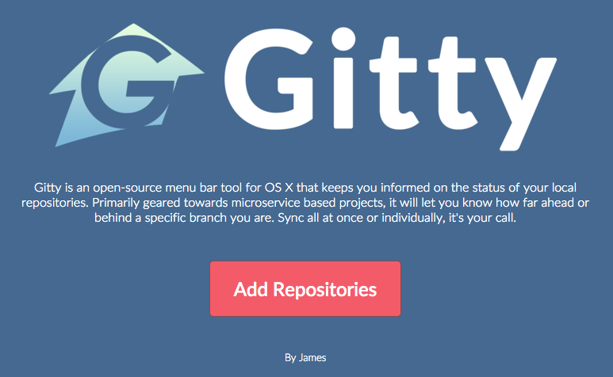

# Gitty

A Git Status watcher to keep your repositories up to date! In the day of microservices it becomes harder and harder to sync your repos.  Many write a custom script to do this, but I felt it would be good to build a full on app.

Enjoy.





## Made with


> Live editing development on desktop app

[Electron](http://electron.atom.io/) application boilerplate based on [React](https://facebook.github.io/react/), [Redux](https://github.com/reactjs/redux), [React Router](https://github.com/reactjs/react-router), [Webpack](http://webpack.github.io/docs/), [React Transform HMR](https://github.com/gaearon/react-transform-hmr) for rapid application development


## Install

Install dependencies.

```bash
$ npm install
```


## Run

Run this two commands __simultaneously__ in different console tabs.

```bash
$ npm run hot-server
$ npm run start-hot
```

or run two servers with one command

```bash
$ npm run dev
```

*Note: requires a node version >= 4 and an npm version >= 2.*

#### Toggle Chrome DevTools

- OS X: <kbd>Cmd</kbd> <kbd>Alt</kbd> <kbd>I</kbd> or <kbd>F12</kbd>
- Linux: <kbd>Ctrl</kbd> <kbd>Shift</kbd> <kbd>I</kbd> or <kbd>F12</kbd>
- Windows: <kbd>Ctrl</kbd> <kbd>Shift</kbd> <kbd>I</kbd> or <kbd>F12</kbd>

*See [electron-debug](https://github.com/sindresorhus/electron-debug) for more information.*

#### Toggle Redux DevTools

- All platforms: <kbd>Ctrl+H</kbd>

*See [redux-devtools-dock-monitor](https://github.com/gaearon/redux-devtools-dock-monitor) for more information.*


## Externals

If you use any 3rd party libraries which can't be built with webpack, you must list them in your `webpack.config.base.js`：

```javascript
externals: [
  // put your node 3rd party libraries which can't be built with webpack here (mysql, mongodb, and so on..)
]
```

You can find those lines in the file.


## Package

```bash
$ npm run package
```

To package apps for all platforms:

```bash
$ npm run package-all
```

#### Options

- --name, -n: Application name (default: ElectronReact)
- --version, -v: Electron version (default: latest version)
- --asar, -a: [asar](https://github.com/atom/asar) support (default: false)
- --icon, -i: Application icon
- --all: pack for all platforms

Use `electron-packager` to pack your app with `--all` options for darwin (osx), linux and win32 (windows) platform. After build, you will find them in `release` folder. Otherwise, you will only find one for your os.

`test`, `tools`, `release` folder and devDependencies in `package.json` will be ignored by default.


